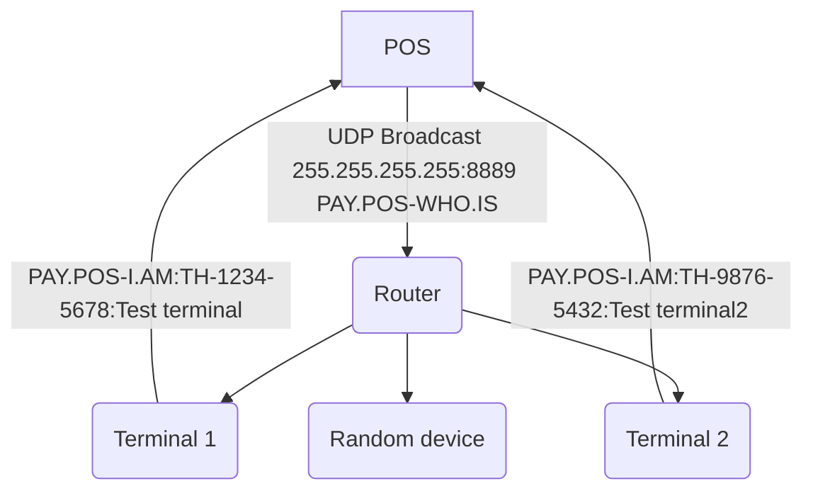

# PAY.POS Local ECR - Discovery protocol (UDP)

### Important data
- The discovery protocol works on port 8889 and uses the UDP broadcast ip (255.255.255.255)
- The broadcast message must contain: `PAY.POS-WHO.IS` (encoded to UTF-8)
- Terminals which supported Local ECR (version 1.1.17 and higher) will respond with: `PAY.POS-I.AM:TH-XXXX-XXXX:TERMINAL_NAME`

### Discovery flow



### Example

```js
const DISCOVERY_TIMEOUT = 3000; // 3 seconds
const DISCOVERY_PORT = 8889;
const DISCOVERY_MESSAGE = 'PAY.POS-WHO.IS';
const DISCOVERY_RESPONSE_MESSAGE = 'PAY.POS-I.AM'

class LocalEcrDiscovery {
    public discoverTerminals() {
        let foundDevicesCount = 0;
        const socket = dgram.createSocket('udp4');
        
        // Listen to UDP responses
        socket.on('message', (buffer, info) => {
            const splitted = buffer.toString().split(':');
            if (splitted.length !== 3 || splitted[0] !== DISCOVERY_RESPONSE_MESSAGE) {
                console.warn('Invalid message received -> probably not a terminal - message: ' + buffer.toString());
                return;
            }

            foundDevicesCount++;
            console.log({ type: 'DISCOVER_RESULT', ipAddress: info.address, code: splitted[1], name: splitted[2] })
        });

        socket.bind(() => {
            socket.setBroadcast(true);

            const message = Buffer.from(DISCOVERY_MESSAGE);
            socket.send(message, 0, message.length, DISCOVERY_PORT, '255.255.255.255');

            // Set timeout to gather responses
            setTimeout(() => {
                console.log({ type: 'DISCOVER_COMPLETED', count: foundDevicesCount });
                socket.close();
            }, DISCOVERY_TIMEOUT);
        });
    }
}
```
